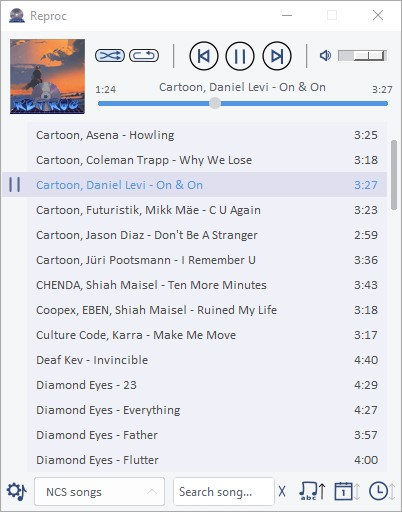

# REPROC - Music Player
Reproc is a free-open Local Music Player multiplaylists written in python.

---

## How to use it
Refer to user guide at
[user_guide.md](docs/user_guide.md)

---

## Features
- Simple interface with many functionalities.
- Handling multiplaylists.
- Modify songs/playlists directly in the application.
- Data constancy when reopening the application.
- Keyboard shortcuts.
- Extra features.

## Dependencies
It has not been extensively tested yet. The following dependencies have been tested while developing on Windows 10.
- Python 3.6 - 3.10.
- Tkinter Tcl/Tk: distributed version with Python.
- [Pillow](https://python-pillow.org/) 8.4.0 : Imaging library for python.
- [Tinytag](https://github.com/devsnd/tinytag) 1.9.0 : Music metadata reader.
- [Pygame](https://www.pygame.org/) 2.2.0 : (only mixer) sdl2 mixer interface for python.

---

## Why open-source software?
***"If the product is free and closed, then you are the product"***  
This project is never made to compete with any other music player, it is just a simple player that I started when I was a programming newbie and whit which I have learned many new things.  
The fact that it is wirtten in a scripting language like python makes it perform worse and slower, as well as having a not very customizable interface due to the the limitations of tcl/tk.  
That is why this is a purely educational project, which must be freely published.

## Feedback
Your feedback is most welcomed by filling a
[new issue](https://github.com/JavideSs/reproc/issues/new).

---

Author:  
Javier Mellado Sánchez  
2020-2023